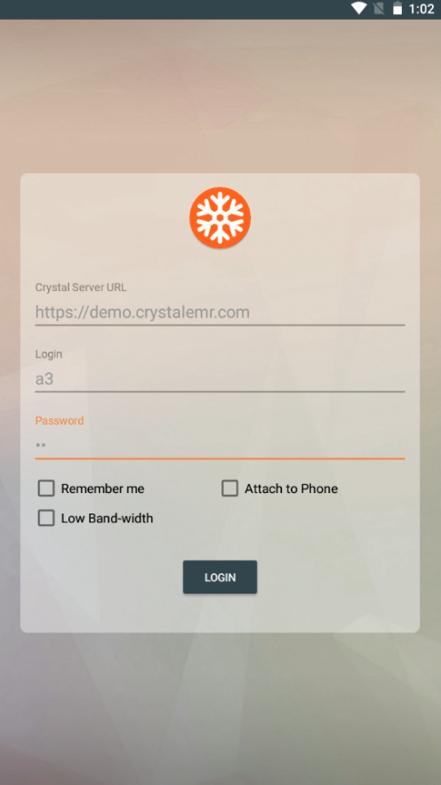

Hardware and CodeMaster
=======================

key Goals
---------

options
--------

.. table:: Comparison

    ========== ========== ============= ======== ==========
     Platform    col1         col2       cost     remarks
    ========== ========== ============= ======== ==========
     one         c1r1          c2r1        10     remark1
     two         c1r2          c2r2        20     remark2
    ========== ========== ============= ======== ==========

Raspberry Pi 
~~~~~~~~~~~~~

Here home page of pi:

Lego Mindstorms
~~~~~~~~~~~~~~~

.. _hwcodeOptions:

use above directive as hyperlink to get exactly at this spot

.. csv-table:: Comparison
    :header: Platform,cost,self,flex
    :widths: 15 10 30 30

    rpi,no, 30, limit
    lego, yes, 35, medium